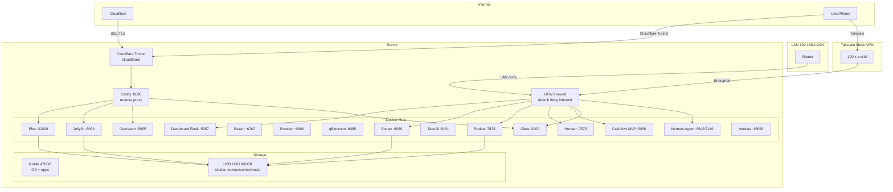

# Panshulo Homelab - Network Architecture

## Network diagram



## Ports exposed on LAN

| Port | Service | Access |
|------|---------|--------|
| 22/tcp | SSH | LAN + Tailscale only |
| 3000/tcp | Gitea | LAN + Cloudflare Tunnel |
| 32400/tcp | Plex | LAN |
| 5050/tcp | Cashflow MVP | LAN |
| 5051/tcp | Student Directory | LAN |
| 5055/tcp | Overseerr | LAN |
| 5057/tcp | Dashboard | LAN |
| 6767/tcp | Bazarr | LAN |
| 7575/tcp | Homarr | LAN |
| 7878/tcp | Radarr | LAN |
| 8080/tcp | Caddy | LAN + Cloudflare Tunnel |
| 8085/tcp | qBittorrent | LAN |
| 8096/tcp | Jellyfin | LAN |
| 8181/tcp | Tautulli | LAN |
| 8642/tcp | Hermes Agent | LAN |
| 8989/tcp | Sonarr | LAN |
| 9119/tcp | Hermes Agent WS | LAN |
| 9696/tcp | Prowlarr | LAN |
| 19999/tcp | Netdata | LAN |

## Security

- UFW: default deny inbound, allowlist only
- Tailscale mesh VPN for remote access (no ports exposed to internet)
- Cloudflare Tunnel for public web services (no open ports on router)
- Caddy reverse proxy with automatic SSL
- IPv6 fully blocked (including Docker forwarded traffic)

## Remote access flow

```
Phone/Laptop
    |
    +-- Cloudflare Tunnel (no open ports)
    |   +-- Gitea, Overseerr
    |
    +-- Tailscale (mesh VPN)
        +-- All services as if on LAN
```
